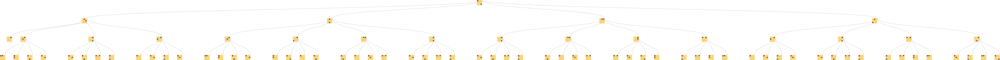
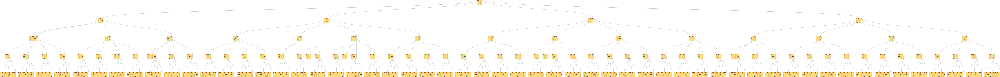

# playing pacman
### with
# monte carlo :evergreen_tree: search
#### @danielepolencic & Eleanor Keane

---


---


---

# [fit] i :heart: strategy games

---

## …does it think _for real_?
## …can I build one?

---

# [fit] the challenge

---


---

## 400 positions __after 2 moves__
## 10,921,506 __after 7 moves__
## avg game ~30 moves

---

## not all moves are the same
## sequence of moves

---


---

## avg game ~150 moves
## 386356909593 games __with 2x2__
## __19x19 -__ 10<sup>10<sup>48</sup></sup> possible games

---


---

## 4 directions
## walls, pills, pacman & ghosts
## 1-5 lives
## score

---

## real time
## ∞ possbile games
## sequence of moves

---

# interesting because…

---

## deterministic movements
## simple to understand
## real time
## constrained space

---

# [fit] hey computer,
# [fit] __what's your__ next move?

^ how does AI play cards?
^ cannot be brute force

---

# brute force :muscle:
# Heuristic
# Neural networks

---

# Brute force :muscle:
# __Heuristic__
# __Neural networks__

---

## fast?
## __easy to implement?__
## __skilled ai player?__

---

## __fast__ :x:
## easy to implement?
## __skilled ai player?__

---

## __fast__ :x:
## __easy to implement__ :white_check_mark:
## skilled ai player?

---

## __fast__ :x:
## __easy to implement__ :white_check_mark:
## __skilled ai player__ :x:

---

# __Brute force__ :muscle:
# Heuristic
# __Neural networks__

---

## fast?
## __easy to implement?__
## __skilled ai player?__

---

## __fast__ :white_check_mark:
## easy to implement?
## __skilled ai player?__

---

## __fast__ :white_check_mark:
## __easy to implement__ :x:
## skilled ai player?

---

## __fast__ :white_check_mark:
## __easy to implement__ :x:
## __skilled ai player__ :white_check_mark:

---

# __Brute force__ :muscle:
# __Heuristic__
# Neural networks

---

## __fast__ :white_check_mark:
## __easy to implement__ :x:
## __skilled ai player__ :white_check_mark:

---

# :weary: :sob:

---

# easy to code & smart,
# __please__

---

# *another* approach

---

# pacman

---


---


---


---


---


---


---


---


---

# :link: of moves

---

# [fit] more like a :evergreen_tree:

---


---


---


---


---


---


---


---


---


---


---


---


---


---

## the next move for pacman is…

---


---


---


---


---


---


---


---


---

# …and if pacman is distracted

---


---


---


---


---

# :bulb: like a human!

---

# recap

---

## 1. explore states
## 2. map winning/losing states
## 3. count

---

## __easy to implement?__
## skilled ai player?
## fast?

---

## coding involved:
## 1. movements
## 2. win/lose

---

## __easy to implement__ :white_check_mark:
## skilled ai player?
## fast?

---

## __easy to implement__ :white_check_mark:
## __skilled ai player__ :white_check_mark:
## fast?

---

## when should I stop?
## how many children per node?
## full :evergreen_tree: for every move?

---

## fast :x:

---

# __unelss__ incremental

---


---


---


---


---


---


---


---


---


---


---


---


---


---


---


---

## the next move for pacman is…

---


---


---


---

## stop at any time
## explore only *promising* branches
## reuse previous states

---


---


---


---

# incremental is fast :white_check_mark:

---

# [fit] demo

---

# [fit] learnings

---

# 1. testing ai is **hard**

---

## is it a bug or feature?
## unit & integration test not enough

---



---



---

## easy to inspect
## extra tooling
## still time consuming

---

# 2. ƛ functional

---

## 𝒻(state, message) -> state

---

```js
function update(state, message) {
  switch(action.type) {

  case PACMAN_MOVES:
    /* ... */

  default:
  return state;
  }
}
```

---

```js
const message = {
  type: PACMAN_MOVES,
  direction: 'left'
};

const state = {
  pacman: {x: 1, y: 0},
  red: {x: 0, y: 2}
};
```

---

## no implicit state
## no need to serialise classes
## memoisation

---

# 3. time travel

---

```js
const list_of_actions = [
  createAction_movePacman('left'),
  createAction_movePacman('right'),
  createAction_movePacman('right')
];

const initial_state = {
  pacman: {x: 1, y: 0},
  red: {x: 0, y: 2}
};

list_of_actions.reduce(update, initial_state);
```

---

## easier to debug
## easier to reproduce bugs/features
## easier to test

---

# thanks
